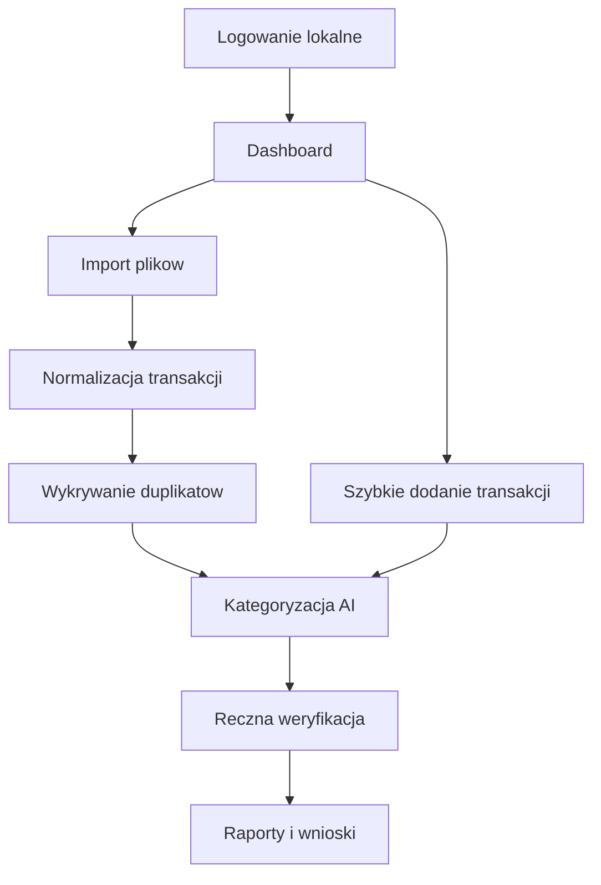

# 00. Project Overview

Data dokumentu: 2026-05-01

## Postep wzgledem roadmapy

**Punkt zatrzymania (2026-05-01):** w kodzie zamkniete sa **Etap 0–6 (MVP)**. **Etap 7 (analityka i rekomendacje) nie jest wdrozony** — przy kontynuacji w nowym czacie zacznij od sekcji *Punkt zatrzymania pracy* w `docs/10_ROADMAP.md`.

Na **2026-05-01** obejmuje to m.in. inwestycje (`/investments`, strategia, operacje), wczesniejsze moduly zgodnie z tabela *Stan implementacji* w `docs/10_ROADMAP.md`.

## Wizja

Produkt jest prywatnym centrum finansow osobistych dla dwoch osob w rodzinie. Ma laczyc domowy budzet, analize wydatkow, przychodow, majatku netto i inwestycji w jednej self-hosted aplikacji webowej.

Aplikacja ma byc prosta w utrzymaniu, tania w hostowaniu i wygodna na komputerach z macOS oraz Windows. Priorytetem jest kontrola finansow i podejmowanie decyzji na podstawie danych, a nie samo archiwizowanie transakcji.

## Problem Do Rozwiazania

Obecnie dane finansowe sa rozproszone miedzy bankami, fintechami, inwestycjami i recznymi notatkami. Reczne kategoryzowanie transakcji jest czasochlonne, a gotowe aplikacje czesto wymagaja oddania danych zewnetrznym uslugom.

Projekt ma rozwiazac ten problem przez:

- import plikow z bankow i fintechow,
- automatyczna normalizacje transakcji,
- kategoryzacje wspierana przez AI,
- reczna weryfikacje przypadkow niepewnych,
- raporty i rekomendacje dotyczace niepotrzebnych wydatkow,
- widok majatku netto i inwestycji.

## Uzytkownicy

Docelowo z aplikacji korzystaja dwie osoby z jednej rodziny. Kazda osoba ma wlasne konto, osobny widok danych i osobny budzet. Aplikacja nie zaklada wspolnego budzetu domowego, rozliczania kto za co zaplacil ani podzialu wydatkow miedzy osoby.

## Najwazniejsze Decyzje Produktowe

- Aplikacja jest webowa, bez osobnej aplikacji mobilnej na start.
- Dostep odbywa sie przez proste lokalne konta.
- Widoki i budzety sa oddzielne dla kazdego uzytkownika.
- Glowna waluta raportowania to PLN.
- Transakcje walutowe sa przeliczane po kursie z dnia transakcji.
- Import odbywa sie przez wrzucenie pliku: CSV, XLS/XLSX, pozniej PDF.
- Dane importowane nie wymagaja zatwierdzania kazdej transakcji, ale transakcje niepewne trafiaja do widoku weryfikacji.
- Kategorie sa zagniezdzone.
- Reguly uzytkownika i reczne korekty maja pierwszenstwo przed AI.
- AI moze byc lokalne, a zewnetrzne API jest dopuszczalne tylko jako swiadoma opcja.
- Projekt ma byc open-source.

## Zakres MVP

MVP powinno dac realna wartosc bez budowania zbyt szerokiego systemu. Minimalny zakres:

- logowanie do jednego z dwoch lokalnych kont,
- konto uzytkownika z oddzielnym zakresem danych,
- reczne szybkie dodawanie wydatkow i przychodow,
- konta finansowe przypisane do uzytkownika,
- import CSV i XLS/XLSX dla mBank, PKO BP, Revolut i ZEN,
- automatyczne wykrywanie duplikatow,
- lista transakcji z wyszukiwaniem i filtrami,
- zagniezdzone kategorie przychodow i wydatkow,
- sugestie kategorii oraz opisow przez AI,
- kolejka transakcji do recznej weryfikacji,
- dashboard z przychodami, wydatkami, majatkiem i inwestycjami,
- raport miesieczny i roczny,
- eksport danych do CSV,
- backup i odtworzenie bazy danych.

## Poza MVP

Te elementy sa wazne, ale powinny powstac po stabilnym MVP:

- import PDF z wyciagow bankowych,
- OCR paragonow,
- automatyczna synchronizacja z bankami,
- zaawansowana analiza portfela inwestycyjnego,
- automatyczne pobieranie cen wielu aktywow,
- obsluga wielu rodzin lub zespolow,
- aplikacja mobilna,
- rozbudowane role uzytkownikow.

## Kryteria Sukcesu

Produkt jest udany, jezeli:

- dwie osoby moga uzywac aplikacji z oddzielnymi widokami,
- miesieczny import plikow bankowych zajmuje kilka minut,
- wiekszosc typowych transakcji dostaje poprawna kategorie bez recznej pracy,
- niepewne transakcje sa jasno widoczne i latwe do poprawienia,
- dashboard pozwala szybko ocenic przychody, wydatki, majatek i inwestycje,
- dane mozna zbackupowac i odtworzyc bez specjalistycznej wiedzy,
- projekt pozostaje mozliwy do utrzymania przez jedna osobe.

## Glowny Przeplyw Uzytkownika

## Zasada Prywatnosci

Domyslnie dane powinny pozostawac na serwerze wlasciciela aplikacji. Jezeli zostanie uzyty zewnetrzny model AI, aplikacja musi jasno pokazywac, jakie dane beda wyslane, do kogo i po co. Zewnetrzne AI nie powinno byc wymagane do podstawowego uzywania produktu.
