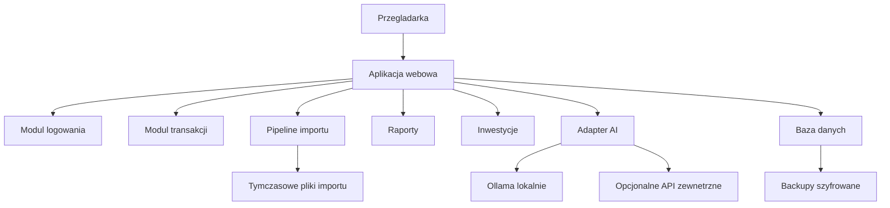
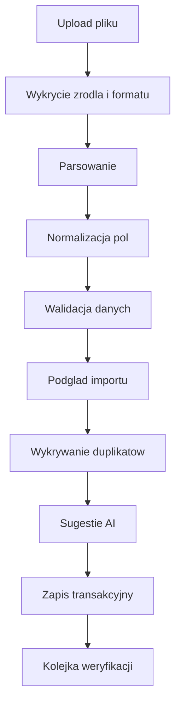
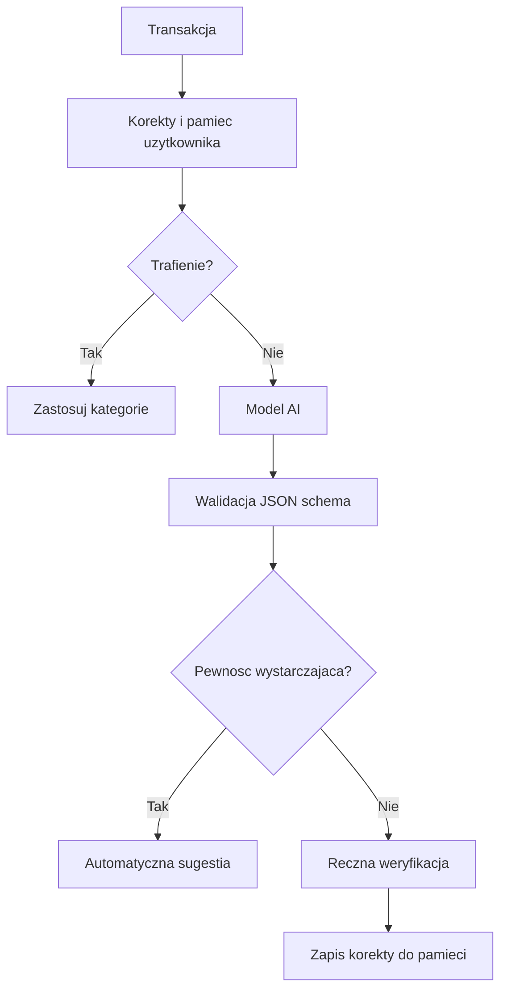
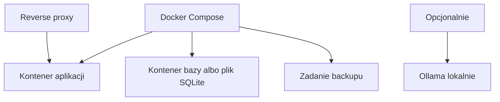

# 04. Architektura Aplikacji

Data dokumentu: 2026-05-01

Ten dokument jest zrodlem prawdy o architekturze. Powinien byc aktualizowany przy kazdej istotnej zmianie: wyborze stacku, zmianie modelu danych, dodaniu integracji, zmianie przeplywu importu, zmianie AI albo zmianie wdrozenia.

**Stan na 2026-05-01:** monolit Next.js + SQLite + Drizzle; import `/imports` (**CSV / XLSX / PDF** + **OCR** zdjec `pol` + **szablony nazw kolumn**); AI `/review`; backup i **`/audit`**; **inwestycje MVP** — tabele `investment_*`, widok **`/investments`**, metryki portfela na dashboardzie. **Analityka (Etap 7):** **`/insights`** — m/m, prognoza, reczne `is_recurring`, **heurystyka** powtarzalnych oplat (`listHeuristicRecurringCandidates`), eksport CSV/PDF. **2FA TOTP (Etap 8, czesciowo):** konfiguracja **`/settings/security`** (`otplib`, QR), drugi krok logowania **`/login/totp`**, tabela `login_totp_pending`. **Responsywnosc (Etap 8, czesciowo):** `viewport` w root layout, istniejace breakpointy (`grid-3`, `form-grid`, `page-header`), klasy **`button-row`** / **`inline-form`** (wrap). **Wykres trendu (Etap 8, czesciowo):** `/insights` — `summarizeRollingMonthsForUser`, `MonthlyTrendChart`. Szczegoly: `docs/10_ROADMAP.md` (rowniez **Backlog** i **plan weryfikacji recznej**).

## 1. Cele Architektoniczne

- Prosta aplikacja self-hosted dla dwoch osob.
- Niski koszt utrzymania.
- Mozliwosc uruchomienia w Docker Compose.
- Domyslna prywatnosc danych.
- Latwe backupy i restore.
- Oddzielne dane uzytkownikow.
- Wymienialny modul AI: lokalny model albo zewnetrzne API.
- Importy plikow jako jawny, testowalny pipeline.

## 2. Rekomendowany Ksztalt Systemu

Na start najlepszym kierunkiem jest monolit webowy. Oznacza to jedna aplikacje zawierajaca UI, logike serwerowa, importy, raporty i panel administracyjny. Osobne procesy moga pojawic sie dopiero wtedy, gdy sa potrzebne operacyjnie, np. worker do dlugiego importu lub AI.

## 3. Wybrany Stack MVP

Decyzja przyjeta w `docs/11_DECISIONS.md`:

- Jezyk: TypeScript.
- Aplikacja: Next.js jako monolit webowy.
- UI: komponenty React, proste wykresy, CSS utility albo lekki system komponentow.
- Baza: SQLite dla najprostszego domowego self-hosted MVP.
- ORM: Drizzle ORM.
- Import XLS/XLSX: biblioteka arkuszy kalkulacyjnych po stronie serwera.
- PDF: osobny etap, z parserem tekstu i twarda walidacja.
- AI lokalne: Ollama z modelem obslugujacym structured JSON output.
- AI zewnetrzne: opcjonalny provider zgodny z podejsciem structured output.
- Wdrozenie: Docker Compose.

## 4. Moduly Domenowe

### Auth

Odpowiada za lokalne konta, sesje, hasla, opcjonalne 2FA i audyt logowan. Nie powinien zawierac logiki finansowej.

**TOTP (RFC 6238):** sekret i flaga `totp_enabled` w `users`; po poprawnym hasle, jesli 2FA wlaczone — utworzenie rekordu `login_totp_pending` i przekierowanie na `/login/totp` (bez sesji do czasu poprawnego kodu). Konfiguracja i wylaczenie w **`/settings/security`** (QR z `qrcode`, URI z `@/lib/totp-app`, issuer **CFO**). Walidacja kodu: `verifySync` (`otplib`).

### Users

Przechowuje profil uzytkownika oraz ustawienia prywatnosci, waluty bazowej i preferencje AI.

### Financial Accounts

Reprezentuje konta bankowe, konta fintech, gotowke i konta inwestycyjne. Kazde konto nalezy do jednego uzytkownika.

### Transactions

Centralny modul zapisujacy przychody, wydatki, transfery i operacje inwestycyjne. Wszystkie raporty powinny korzystac z tego modulu albo z przygotowanych agregacji.

### Categories

Obsluguje zagniezdzone kategorie i ich typy: przychod, wydatek, inwestycja, transfer.

### Imports

Przetwarza pliki bankowe. Pipeline importu powinien byc deterministyczny, testowalny i transakcyjny. **Neutralny import:** CSV i XLSX (`parse-file.ts`), **PDF** (`pdf-parse`, tabele / tekst), **zdjecia paragonow** PNG/JPEG/WebP — **Tesseract** (`tesseract.js`, jezyk **`pol`**), potem ten sam podzial kolumn co przy tekscie z PDF. **`@/domain/import-presets`** — przykladowe szablony nazw kolumn (linki na `/imports`), bez automatycznych parserow bankowych. Skany PDF bez warstwy tekstowej: komunikat z sugestia zapisu strony jako obraz (OCR) lub CSV/XLSX. **Mobilnosc (Etap 8):** `viewport`, breakpoint 800px na siatkach, **`inline-form`** / **`button-row`** / **`card-heading-row`** / **`field-row`** na kluczowych widokach.

### AI

Nie powinien bezposrednio zapisywac finalnych danych finansowych. Powinien generowac sugestie, ktore aplikacja waliduje i zapisuje jako propozycje albo automatycznie akceptuje tylko przy wysokiej pewnosci.

### Reports

Odpowiada za dashboard, raporty miesieczne, roczne, trendy i prognozy. **Analityka (Etap 7):** `@/db/analytics` (m.in. m/m, prognoza, sumy `is_recurring`, heurystyka merchant/opis); UI **`/insights`**; eksport CSV/PDF (`@/lib/insights-pdf`). **Etap 8 (czesciowo):** trend **12 miesiecy** na `/insights` — `summarizeRollingMonthsForUser`, komponent SVG **`MonthlyTrendChart`** (przychody vs wydatki).

### Investments

Przechowuje aktywa, operacje, cele, alokacje i wyceny. W MVP moze byc prosty, ale model powinien nie blokowac pozniejszego rebalancingu.

### Operations

Backup, restore, eksport danych, health check i zadania administracyjne.

## 5. Przeplyw Importu

Zasady:

- Plik zrodlowy jest przetwarzany jako import batch.
- Parser bankowy tworzy format kanoniczny transakcji.
- Import nie powinien zapisywac czesci danych, jesli caly batch nie przejdzie walidacji krytycznej.
- Deduplikacja powinna uzywac stabilnego odcisku transakcji.
- AI jest etapem wzbogacania, nie etapem prawdy.
- Transakcje niepewne pozostaja widoczne w kolejce weryfikacji.

## 6. Przeplyw Kategoryzacji AI

AI nie moze zwracac dowolnego tekstu jako danych produkcyjnych. Odpowiedz modelu powinna byc walidowana schematem.

## 7. Granice Danych

Kazdy rekord finansowy powinien miec `userId` albo nalezec do encji, ktora ma `userId`. Nie nalezy polegac tylko na filtrach w UI. Separacja danych musi byc wymuszona w logice serwerowej.

## 8. Baza Danych

### SQLite

Zalety:

- najprostsze self-hosted uruchomienie,
- jeden plik bazy,
- latwy backup,
- niskie wymagania.

Ryzyka:

- trzeba szczegolnie uwazac na backup podczas zapisu,
- mniej wygodne zaawansowane operacje wspolbiezne,
- szyfrowanie moze wymagac dodatkowych decyzji.

### PostgreSQL

Zalety:

- solidna baza na lata,
- lepsza wspolbieznosc,
- dojrzale backupy,
- latwiejsza przyszla rozbudowa.

Ryzyka:

- wiecej elementow operacyjnych,
- nieco ciezsze wdrozenie,
- wymaga kontenera lub zarzadzanej uslugi.

Decyzja MVP: zaczac od SQLite. Backup szyfrowany i restore sa nastepnym etapem przed realnym uzyciem danych finansowych.

## 9. Strategia AI

Warstwy AI:

1. Pamiec korekt uzytkownika i proste dopasowania.
2. Lokalny model przez Ollama.
3. Opcjonalny zewnetrzny model, jesli lokalny nie daje wystarczajacej jakosci.

Wszystkie tryby powinny korzystac z tego samego interfejsu aplikacyjnego:

- wejscie: transakcja, lista kategorii, kontekst historyczny,
- wyjscie: kategoria, opis, tagi, pewnosc, uzasadnienie techniczne,
- walidacja: schema JSON,
- decyzja: automatyczna akceptacja albo reczna weryfikacja.

## 10. Raporty i Agregacje

Raporty powinny korzystac z transakcji jako zrodla prawdy. Agregacje moga byc cacheowane, ale cache musi dac sie odbudowac z danych zrodlowych.

Najwazniejsze agregacje:

- suma przychodow per miesiac,
- suma wydatkow per miesiac,
- suma wydatkow per kategoria,
- bilans miesieczny,
- majatek netto,
- wartosc inwestycji,
- trendy i odchylenia miesiac do miesiaca.

## 11. Backup i Restore

Backup powinien obejmowac:

- baze danych,
- konfiguracje niezawierajaca sekretow,
- metadane wersji aplikacji,
- opcjonalnie zaszyfrowane zalaczniki/importy, jesli kiedys beda przechowywane.

Restore powinien byc mozliwy na pustej instalacji zgodnej wersji aplikacji.

## 12. Minimalny Deployment

Warianty:

- LAN/home server: pierwszy wariant wdrozenia, najprostszy i najprywatniejszy.
- VPS: wygodny dostep z internetu, wymaga HTTPS, aktualizacji i mocniejszego zabezpieczenia.
- Komputer domowy + VPN/Tailscale: kompromis miedzy prywatnoscia i dostepem zdalnym.

## 13. Zasady Rozwoju

- Nie dodawac nowych serwisow bez konkretnej potrzeby.
- Najpierw stabilny import CSV/XLS, potem PDF.
- Najpierw raporty deterministyczne, potem rekomendacje AI.
- Najpierw reczne inwestycje, potem automatyczne ceny.
- Kazdy parser bankowy powinien miec testy na przykladowych plikach.
- Kazda odpowiedz AI powinna byc walidowana i mozliwa do recznego poprawienia.
