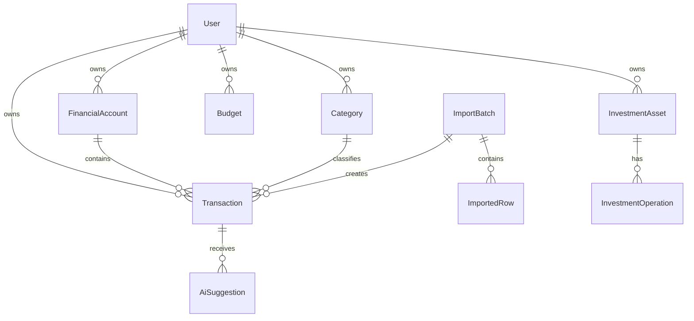

# 05. Model Danych

Data dokumentu: 2026-05-01

Ten dokument opisuje model logiczny, nie finalna skladnie migracji. Nazwy pol sa orientacyjne i powinny zostac dopasowane do wybranego ORM oraz bazy.

## 1. Zasady Modelowania

- Kazde dane finansowe sa przypisane do uzytkownika.
- Transakcja jest zrodlem prawdy dla raportow.
- Importy sa zapisywane jako osobne batch'e, aby mozna bylo diagnozowac bledy.
- AI zapisuje sugestie i metadane, a nie niekontrolowane decyzje.
- Kategorie sa zagniezdzone.
- Wartosci raportowe sa przechowywane w PLN.
- Kwoty powinny byc przechowywane jako liczby calkowite w groszach albo typ dziesietny, nigdy jako float.

## 2. Relacje Glownych Encji

## 3. User

Reprezentuje lokalne konto osoby.

Pola:

- `id`
- `emailOrLogin`
- `displayName`
- `passwordHash`
- `baseCurrency`, domyslnie `PLN`
- `aiMode`, np. `disabled`, `local`, `external`
- `createdAt`
- `updatedAt`

Uwagi:

- MVP nie wymaga rol.
- Konto powinno miec mozliwosc dezaktywacji albo usuniecia danych w pozniejszym etapie.

## 4. FinancialAccount

Reprezentuje konto bankowe, fintech, gotowke albo konto inwestycyjne.

Pola:

- `id`
- `userId`
- `name`
- `institution`, np. `mBank`, `PKO BP`, `Revolut`, `ZEN`, `manual`
- `type`, np. `bank`, `cash`, `investment`, `crypto`, `savings`
- `currency`
- `externalAccountHint`, np. ostatnie cyfry rachunku lub nazwa eksportu
- `isActive`
- `createdAt`
- `updatedAt`

## 5. Transaction

Centralna encja finansowa.

Pola:

- `id`
- `userId`
- `financialAccountId`
- `categoryId`
- `type`, np. `income`, `expense`, `transfer`, `investment`
- `transactionDate`
- `postedDate`
- `amountMinor`
- `currency`
- `amountPlnMinor`
- `fxRate`
- `merchantName`
- `counterpartyName`
- `description`
- `rawDescription`
- `tagList`
- `isRecurringCandidate`
- `isTransferCandidate`
- `verificationStatus`, np. `verified`, `needs_review`, `auto_categorized`
- `source`, np. `manual`, `import`
- `importBatchId`
- `dedupeKey`
- `createdAt`
- `updatedAt`

Uwagi:

- `amountMinor` przechowuje oryginalna kwote w najmniejszej jednostce waluty.
- `amountPlnMinor` jest podstawa raportow.
- `rawDescription` pochodzi z banku i nie powinien byc nadpisywany przez AI.
- `description` moze byc wygenerowany lub poprawiony recznie.

## 6. Category

Zagniezdzona kategoria.

Pola:

- `id`
- `userId`
- `parentId`
- `name`
- `type`, np. `income`, `expense`, `investment`
- `sortOrder`
- `isSystem`
- `isArchived`
- `createdAt`
- `updatedAt`

Uwagi:

- Kategorie startowe moga byc utworzone per uzytkownik na podstawie szablonu.
- Archiwizacja jest bezpieczniejsza niz usuwanie kategorii uzytej w transakcjach.

## 7. Budget

Miesieczny limit kategorii.

Pola:

- `id`
- `userId`
- `categoryId`
- `month`
- `limitPlnMinor`
- `createdAt`
- `updatedAt`

Uwagi:

- Budzety sa osobne dla uzytkownikow.
- Brak alertow push w MVP; wystarczy widok wykorzystania i prognoza.

## 8. ImportBatch

Opis jednego importu pliku.

Pola:

- `id`
- `userId`
- `financialAccountId`
- `sourceInstitution`
- `fileName`
- `fileType`
- `fileHash`
- `status`, np. `uploaded`, `parsed`, `failed`, `imported`
- `rowsTotal`
- `rowsImported`
- `rowsSkippedDuplicate`
- `rowsNeedsReview`
- `errorSummary`
- `createdAt`
- `completedAt`

Uwagi:

- Nie nalezy trzymac pliku zrodlowego dluzej niz potrzeba, chyba ze zostanie swiadomie wlaczone archiwizowanie.
- `fileHash` pomaga wykryc ponowny import tego samego pliku.

## 9. ImportedRow

Reprezentuje wiersz pliku po parsowaniu.

Pola:

- `id`
- `importBatchId`
- `rowNumber`
- `rawDataJson`
- `normalizedDataJson`
- `status`
- `errorMessage`
- `transactionId`

Uwagi:

- `rawDataJson` moze zawierac dane finansowe, wiec podlega zasadom prywatnosci.
- W MVP mozna ograniczyc przechowywanie raw danych po udanym imporcie, jesli wymaga tego prywatnosc.

## 10. ImportMapping

Zapamietane mapowanie kolumn dla banku i formatu.

Pola:

- `id`
- `userId`
- `institution`
- `fileType`
- `versionLabel`
- `mappingJson`
- `createdAt`
- `updatedAt`

## 11. AiSuggestion

Sugestia AI dla transakcji.

Pola:

- `id`
- `userId`
- `transactionId`
- `provider`
- `model`
- `suggestedCategoryId`
- `suggestedDescription`
- `suggestedTagsJson`
- `confidence`
- `reasonCode`
- `status`, np. `pending`, `accepted`, `rejected`, `superseded`
- `createdAt`

Uwagi:

- Nie przechowywac pelnych promptow z danymi finansowymi, jesli nie jest to konieczne.
- Wystarczy zapisac minimalne metadane do audytu i poprawy jakosci.

## 12. UserCorrectionMemory

Pamiec recznych korekt.

Pola:

- `id`
- `userId`
- `patternType`, np. `merchant`, `description_contains`, `counterparty`
- `patternValue`
- `categoryId`
- `confidenceBoost`
- `lastUsedAt`
- `createdAt`

Uwagi:

- To nie jest reczna lista regul tworzona przez uzytkownika, tylko lekka pamiec korekt.
- Reguly z tej tabeli maja pierwszenstwo przed modelem.

## 13. InvestmentAsset

Aktywo inwestycyjne.

Pola:

- `id`
- `userId`
- `name`
- `ticker`
- `type`, np. `etf`, `stock`, `bond`, `crypto`, `ike_ikze`, `cash`
- `currency`
- `quantity`
- `averageCostPlnMinor`
- `currentValuePlnMinor`
- `targetAllocationPercent`
- `createdAt`
- `updatedAt`

## 14. InvestmentOperation

Operacja na aktywie.

Pola:

- `id`
- `userId`
- `investmentAssetId`
- `type`, np. `buy`, `sell`, `dividend`, `deposit`, `withdrawal`, `valuation_update`
- `operationDate`
- `quantity`
- `amountPlnMinor`
- `feePlnMinor`
- `note`
- `createdAt`

## 15. InvestmentStrategy

Plan lokowania nadwyzek.

Pola:

- `id`
- `userId`
- `name`
- `isActive`
- `rulesJson`
- `createdAt`
- `updatedAt`

Przyklad `rulesJson`:

- minimalna poduszka finansowa,
- procent nadwyzki na ETF,
- procent nadwyzki na obligacje,
- docelowa alokacja,
- progi rebalancingu.

## 16. AuditLog

Audyt zdarzen.

Pola:

- `id`
- `userId`
- `eventType`
- `entityType`
- `entityId`
- `metadataJson`
- `createdAt`

Uwagi:

- `metadataJson` nie powinno zawierac pelnych danych transakcji.
- Audyt obejmuje logowania, importy, backup, restore i usuwanie danych.

**Implementacja MVP (kod):** tabela SQL `audit_events` — pola `action` (typ zdarzenia), `meta_json`, `user_id` (nullable dla zdarzen systemowych / nieudanego logowania bez jednoznacznego konta).

## 17. BackupRecord

Metadane backupu.

Pola:

- `id`
- `status`
- `destination`
- `encrypted`
- `fileName`
- `sizeBytes`
- `checksum`
- `createdAt`
- `completedAt`
- `errorMessage`

## 18. Deduplikacja Transakcji

Proponowany `dedupeKey` powinien bazowac na stabilnych polach:

- `userId`,
- `financialAccountId`,
- data transakcji,
- kwota,
- waluta,
- znormalizowany opis lub kontrahent,
- identyfikator transakcji z banku, jesli istnieje.

Nie nalezy polegac tylko na jednej cesze, np. kwocie lub opisie.

## 19. Dane Walutowe

Dla transakcji walutowych nalezy zapisac:

- oryginalna walute,
- oryginalna kwote,
- kurs z dnia transakcji,
- wartosc w PLN.

Zrodlo kursu powinno zostac zapisane przy transakcji albo w osobnej tabeli kursow, jezeli kursy beda pobierane automatycznie.

## 20. Migracje

Kazda zmiana modelu danych powinna miec migracje i wpis w dokumentacji, jezeli zmienia znaczenie danych albo wymaga migracji istniejacych rekordow.
