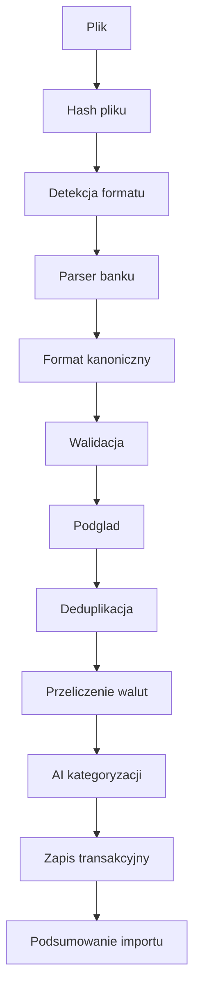

# 06. Importy Bankowe

Data dokumentu: 2026-05-01

## 1. Cel

Import ma pozwalac raz w tygodniu lub raz w miesiacu wrzucic pliki z bankow i fintechow, a nastepnie szybko otrzymac znormalizowane transakcje bez duplikatow.

Obslugiwane zrodla docelowe:

- mBank,
- PKO BP,
- Revolut,
- ZEN.

Formaty:

- CSV - P0,
- XLS/XLSX - P0,
- PDF - P2, po stabilizacji importu tabelarycznego.

Pierwsza implementacja neutralnego importera obsluguje CSV i XLSX z recznym mapowaniem kolumn. Legacy XLS wymaga konwersji do CSV/XLSX do czasu wyboru parsera, ktory przechodzi audyt zaleznosci bez wymuszonych zmian.

## 2. Zasady Importu

- Import zawsze jest przypisany do uzytkownika i konta finansowego.
- Aplikacja pokazuje podglad przed finalnym zapisem.
- Parser tworzy format kanoniczny, niezalezny od banku.
- Deduplikacja jest wymagana.
- Mapowanie kolumn moze byc zapamietane.
- Import nie wymaga zatwierdzania kazdej transakcji.
- Transakcje z niska pewnoscia kategorii trafiaja do kolejki weryfikacji.
- Przykladowe pliki od uzytkownika sa wymagane przed finalnym parserem dla kazdego banku.

## 3. Format Kanoniczny Transakcji

Parser kazdego banku powinien zwrocic:

- `transactionDate`,
- `postedDate`,
- `amount`,
- `currency`,
- `amountPln`,
- `merchantName`,
- `counterpartyName`,
- `rawDescription`,
- `transactionTypeRaw`,
- `bankReference`,
- `balanceAfter`, jesli dostepne,
- `sourceInstitution`,
- `sourceAccountHint`.

## 4. Pipeline

## 5. Walidacja

Walidacje krytyczne:

- data transakcji jest poprawna,
- kwota jest poprawna,
- waluta jest rozpoznana,
- konto docelowe jest wybrane,
- typ importu jest rozpoznany albo mapowanie kolumn jest kompletne.

Walidacje ostrzegawcze:

- brak kontrahenta,
- brak salda po transakcji,
- nietypowy format opisu,
- transakcja walutowa bez kursu,
- plik wyglada na wycinek okresu, a nie pelny eksport.

## 6. Deduplikacja

Deduplikacja powinna dzialac na dwoch poziomach:

1. Plik: hash pliku wykrywa ponowne wrzucenie identycznego pliku.
2. Transakcja: `dedupeKey` wykrywa transakcje powtarzajace sie w roznych eksportach.

Proponowane pola do `dedupeKey`:

- uzytkownik,
- konto,
- data,
- kwota,
- waluta,
- znormalizowany opis,
- identyfikator bankowy, jesli istnieje.

System powinien pokazywac liczbe pominietych duplikatow po imporcie.

## 7. mBank

Zakres docelowy:

- import CSV jako pierwszy,
- XLS/XLSX, jesli eksport uzytkownika jest w arkuszu,
- PDF pozniej.

Spodziewane pola do sprawdzenia na przykladowym pliku:

- data operacji,
- data ksiegowania,
- opis operacji,
- tytul,
- kontrahent,
- kwota,
- waluta,
- saldo po operacji,
- numer rachunku albo referencja, jesli dostepne.

Ryzyka:

- rozne warianty eksportu,
- kodowanie polskich znakow,
- roznice separatorow CSV,
- eksport kilku kont osobno.

## 8. PKO BP

Zakres docelowy:

- CSV/XLS jako podstawowy import,
- osobne mapowanie dla roznych typow rachunkow, jesli przykladowe pliki beda sie roznic.

Spodziewane pola do sprawdzenia:

- data operacji,
- data waluty lub ksiegowania,
- typ operacji,
- opis,
- nadawca/odbiorca,
- kwota,
- waluta,
- saldo.

Ryzyka:

- formaty iPKO moga roznic sie od historii karty,
- opisy przelewow i platnosci karta moga miec inna strukture,
- pliki XLS moga miec naglowki, stopki albo sekcje informacyjne.

## 9. Revolut

Zakres docelowy:

- CSV jako pierwszy wybor,
- XLS/XLSX, jesli eksport zostanie przygotowany w arkuszu,
- obsluga wielu walut przez przeliczenie na PLN.

Typowe pola do sprawdzenia:

- date started,
- date completed,
- ID,
- type,
- description,
- payer,
- original currency,
- original amount,
- payment currency,
- amount,
- fee,
- balance,
- account.

Ryzyka:

- eksporty per waluta,
- oplaty jako osobne pola,
- top-upy i wymiany walut,
- transakcje zagraniczne i kursy.

## 10. ZEN

Zakres docelowy:

- CSV/XLS po analizie przykladowego eksportu,
- szczegolna walidacja oplat, cashbackow i przewalutowan.

Do potwierdzenia na pliku:

- dostepne formaty eksportu,
- identyfikator transakcji,
- sposob zapisu oplat,
- sposob zapisu zwrotow,
- waluta i kurs.

## 11. Przeliczanie Walut

Glowna waluta raportowania to PLN. Kurs powinien pochodzic z dnia transakcji.

Mozliwe zrodla kursu:

- kurs z pliku bankowego, jesli jest podany,
- tabela kursow NBP dla walut fiat,
- kurs zewnetrzny dla krypto lub aktywow inwestycyjnych,
- reczne ustawienie kursu, jezeli automatyczne zrodlo jest niedostepne.

Priorytet:

1. Kurs jawnie podany w pliku.
2. Kurs z oficjalnego zrodla dla dnia transakcji.
3. Reczna korekta uzytkownika.

## 12. Import PDF

PDF nie powinien byc traktowany jako rownie pewny jak CSV/XLS. Plan dla PDF:

- ekstrakcja tekstu,
- wykrycie tabel,
- normalizacja,
- kontrola sum,
- podglad,
- wymuszenie recznej akceptacji przy niskiej pewnosci.

PDF trafia po MVP, bo rozne banki moga generowac PDF-y trudne do stabilnego parsowania.

## 13. Testy Parserow

Dla kazdego banku wymagane:

- minimum jeden przykladowy plik zanonimizowany,
- test liczby transakcji,
- test pierwszej i ostatniej transakcji,
- test kwot i walut,
- test polskich znakow,
- test duplikatu,
- test blednego pliku.

## 14. Prywatnosc Importu

Pliki importu zawieraja dane finansowe. Domyslne zachowanie:

- plik zrodlowy jest przechowywany tylko tymczasowo,
- po przetworzeniu zostaje usuniety,
- w bazie zostaja tylko znormalizowane dane i minimalne metadane importu,
- logi nie zawieraja pelnych wierszy z pliku.

## 15. Informacje Potrzebne Przed Implementacja Parserow

Dla kazdego banku potrzebne beda przykladowe pliki:

- jeden plik z wydatkami karta,
- jeden plik z przelewami,
- jeden plik z przychodami,
- jeden plik z transakcjami walutowymi, jesli wystepuja,
- jeden plik z pustym lub nietypowym okresem, jesli bank go generuje.

Pliki moga byc zanonimizowane, ale musza zachowac strukture kolumn, format dat i przykladowe typy operacji.
