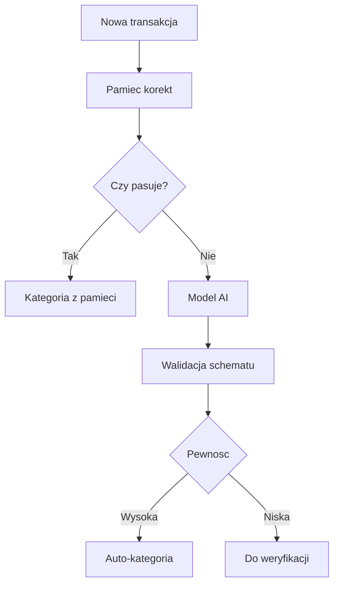

# 07. AI, Kategoryzacja i Rekomendacje

Data dokumentu: 2026-05-01

## 1. Cel AI

AI ma zmniejszyc reczna prace przy kategoryzacji i pomoc w analizie niepotrzebnych wydatkow. Model nie jest zrodlem prawdy. Zrodlem prawdy pozostaje transakcja zatwierdzona przez system albo uzytkownika.

AI ma wspierac:

- wybor kategorii,
- generowanie krotkiego opisu,
- proponowanie tagow,
- wskazywanie transakcji do weryfikacji,
- wykrywanie stale rosnacych kosztow,
- rekomendacje ograniczenia niepotrzebnych wydatkow.

## 2. Zasady Bezpieczenstwa AI

- AI nie moze samodzielnie usuwac ani zmieniac zatwierdzonych danych.
- Odpowiedz AI musi byc walidowana schematem.
- Niska pewnosc oznacza reczna weryfikacje.
- Reczna korekta ma pierwszenstwo przed AI.
- Zewnetrzne AI wymaga jawnej konfiguracji.
- Prompt nie powinien zawierac wiecej danych niz potrzeba.
- Nie nalezy logowac pelnych promptow z danymi finansowymi.

## 3. Tryby AI

### Tryb lokalny

Preferowany dla prywatnosci. Model dziala przez lokalna usluge, np. Ollama. Aplikacja wysyla dane tylko do lokalnego endpointu.

Zalety:

- dane nie opuszczaja infrastruktury uzytkownika,
- brak kosztu per request,
- mozliwosc dzialania offline po pobraniu modelu.

Ryzyka:

- gorsza jakosc niz najlepsze modele zewnetrzne,
- wolniejsze dzialanie na slabym sprzecie,
- potrzeba pamieci RAM i miejsca na modele.

### Tryb zewnetrzny

Opcjonalny. Uzywany, jesli lokalny model nie daje wystarczajacej jakosci.

Zalety:

- zwykle lepsza jakosc,
- brak potrzeby mocnego sprzetu,
- szybsze wdrozenie zaawansowanych analiz.

Ryzyka:

- dane finansowe moga opuscic serwer,
- koszty API,
- zaleznosc od providera,
- wymagana jasna polityka prywatnosci.

### Tryb bez AI

Aplikacja powinna nadal dzialac:

- reczna kategoryzacja,
- pamiec korekt,
- proste dopasowania tekstowe,
- kolejka weryfikacji.

## 4. Warstwy Decyzyjne

Kolejnosc decydowania o kategorii:

1. Reczna korekta uzytkownika dla tej transakcji.
2. Pamiec korekt podobnych transakcji.
3. Bardzo pewne dopasowanie systemowe.
4. Model AI.
5. Reczna weryfikacja.



## 5. Dane Wejsciowe Do Modelu

Minimalny kontekst:

- znormalizowana nazwa sklepu lub kontrahenta,
- surowy opis z banku,
- kwota,
- waluta,
- data,
- typ operacji,
- konto/zrodlo,
- lista dozwolonych kategorii,
- kilka podobnych poprzednich decyzji uzytkownika, jesli istnieja.

Nie wysylac:

- pelnej historii finansowej,
- danych logowania,
- numerow rachunkow,
- niepotrzebnych identyfikatorow,
- danych drugiego uzytkownika.

## 6. Schemat Odpowiedzi

Model powinien zwracac strukture zgodna z JSON schema:

```json
{
  "categoryId": "string",
  "categoryPath": ["Wydatki", "Jedzenie w domu"],
  "description": "string",
  "tags": ["string"],
  "confidence": 0.0,
  "needsManualReview": true,
  "reasonCode": "merchant_match"
}
```

Wymagania:

- `categoryId` musi istniec w bazie.
- `confidence` musi byc liczba od 0 do 1.
- `needsManualReview` wynika z progu pewnosci i walidacji.
- `reasonCode` sluzy do diagnostyki, nie do pokazywania jako porada finansowa.

## 7. Progi Pewnosci

Proponowany start:

- `>= 0.85` - automatyczna akceptacja sugestii,
- `0.60 - 0.84` - sugestia widoczna, ale wymaga weryfikacji,
- `< 0.60` - brak kategorii albo kategoria "do sprawdzenia".

Progi powinny byc konfigurowalne technicznie, ale nie musza miec UI w MVP.

## 8. Reczna Weryfikacja

Widok "do weryfikacji" powinien pokazac:

- transakcje,
- sugestie AI,
- poziom pewnosci,
- szybki wybor kategorii,
- mozliwosc zaakceptowania wielu podobnych transakcji,
- informacje, czy korekta zostanie zapamietana.

Weryfikacja powinna byc szybka, bo aplikacja bedzie uzywana 1-2 razy w tygodniu.

## 9. Uczenie Z Korekt

Po recznej poprawce system moze zapisac:

- wzorzec merchant/description,
- wybrana kategorie,
- date ostatniego uzycia,
- liczbe trafien,
- poziom zaufania.

To jest prostsze i bardziej przewidywalne niz trenowanie wlasnego modelu.

## 10. Rekomendacje Optymalizacji Wydatkow

AI moze generowac rekomendacje dopiero na podstawie agregatow, nie pojedynczych wrazen.

Przyklady rekomendacji:

- "Subskrypcje wzrosly o 35% wzgledem poprzedniego miesiaca."
- "Jedzenie w pracy przekracza srednia z ostatnich 3 miesiecy."
- "W tej kategorii wystepuja powtarzalne platnosci o podobnej kwocie."
- "Po odjeciu typowych kosztow zostaje X PLN nadwyzki do podzialu wedlug strategii."

AI powinno wskazywac dane zrodlowe rekomendacji:

- okres,
- kategorie,
- porownanie,
- kwote roznicy,
- pewnosc lub zastrzezenie.

## 11. Granice Rekomendacji

Aplikacja nie powinna udawac doradcy finansowego. Rekomendacje inwestycyjne powinny byc opisane jako analiza i przypomnienie strategii uzytkownika, nie jako niezalezna porada inwestycyjna.

Zakazane w MVP:

- automatyczne polecenia kupna/sprzedazy,
- obietnice zysku,
- oceny ryzyka inwestycyjnego bez danych,
- rekomendacje podatkowe.

## 12. Testowanie AI

Testy powinny obejmowac:

- poprawny JSON,
- nieistniejaca kategorie,
- niski confidence,
- puste albo dziwne opisy,
- polskie znaki,
- podobne transakcje z roznych bankow,
- transakcje przychodowe,
- transfery wewnetrzne,
- subskrypcje.

## 13. Minimalny Prompt

Prompt powinien byc krotki i deterministyczny:

- rola: klasyfikator transakcji,
- lista dozwolonych kategorii,
- dane jednej transakcji,
- podobne decyzje uzytkownika,
- wymagany JSON,
- zakaz tworzenia nowych kategorii bez zgody.

Temperatura modelu powinna byc niska, aby odpowiedzi byly powtarzalne.

## 14. Metryki Jakosci

Warto mierzyc:

- procent transakcji auto-kategoryzowanych,
- procent korekt po auto-kategoryzacji,
- liczbe transakcji w kolejce weryfikacji,
- dokladnosc per kategoria,
- czas przetworzenia importu,
- koszt zewnetrznego AI, jesli wlaczone.
