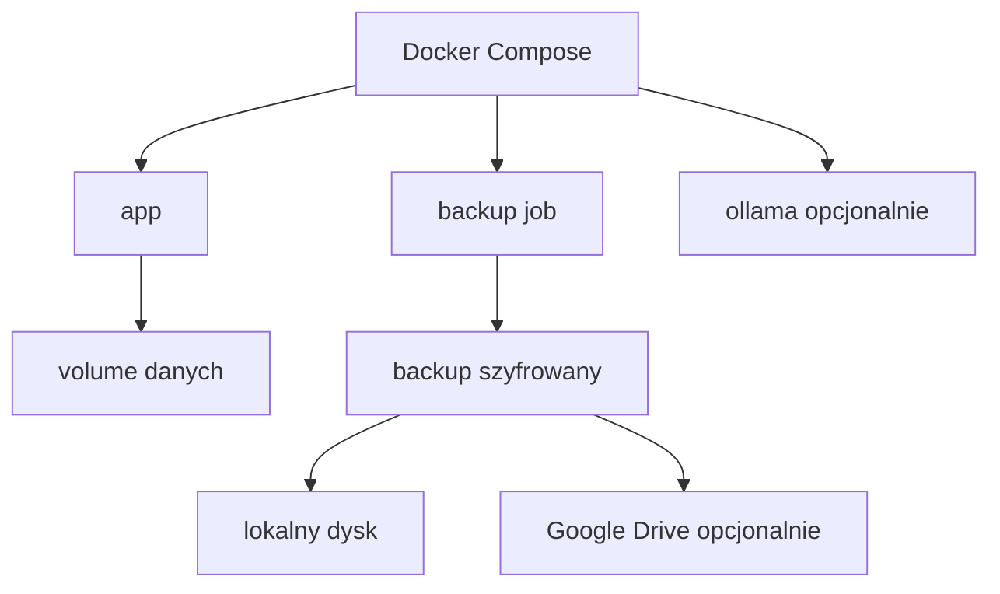

# 09. Wdrozenie i Operacje

Data dokumentu: 2026-05-01

## 1. Cel

Aplikacja ma byc latwa do uruchomienia samodzielnie i tania w utrzymaniu. Domyslna metoda wdrozenia to Docker Compose.

## 2. Warianty Hostowania

### Siec lokalna w domu

Najprostszy i najbardziej prywatny wariant.

Zalety:

- dane zostaja w domu,
- brak kosztu VPS,
- prostsza prywatnosc AI lokalnego.

Ryzyka:

- dostep spoza domu wymaga VPN albo dodatkowej konfiguracji,
- awaria komputera moze zatrzymac aplikacje,
- backup poza urzadzenie jest szczegolnie wazny.

### VPS

Dobra opcja, jesli aplikacja ma byc dostepna przez internet.

Zalety:

- staly dostep,
- latwiejszy HTTPS,
- niezalezny od domowego komputera.

Ryzyka:

- dane trafiaja na cudza infrastrukture,
- trzeba dbac o aktualizacje i zabezpieczenia,
- publiczny endpoint zwieksza powierzchnie ataku.

### Domowy serwer plus VPN

Kompromis dla prywatnosci i dostepu zdalnego.

Zalety:

- dane zostaja lokalnie,
- brak publicznego wystawienia aplikacji,
- wygodny dostep z laptopow.

Ryzyka:

- dodatkowa konfiguracja VPN/Tailscale,
- zaleznosc od lacza domowego.

## 3. Rekomendowany Start

Na MVP:

- Docker Compose,
- aplikacja webowa,
- baza SQLite,
- lokalny folder danych,
- szyfrowany backup lokalny,
- opcjonalnie backup do Google Drive,
- AI wylaczone albo lokalne przez Ollama.

Pierwszy cel wdrozenia to domowy serwer/LAN. Wariant VPS i dostep publiczny sa poza pierwszym fundamentem aplikacji.

## 4. Docelowy Compose

Minimalne uslugi:

- `app` - aplikacja webowa,
- `backup` - zadanie backupu albo komenda w aplikacji,
- `ollama` - opcjonalnie, jesli lokalny AI bedzie uruchamiany w kontenerze lub obok.

## 5. Zmienne Srodowiskowe

Planowane zmienne:

- `APP_URL`
- `SESSION_SECRET`
- `DATABASE_URL`
- `BACKUP_ENCRYPTION_KEY`
- `BACKUP_DESTINATION`
- `BACKUP_RETENTION_DAYS` (opcjonalnie, dla `npm run backup:scheduled`)
- `GOOGLE_DRIVE_CLIENT_ID`
- `GOOGLE_DRIVE_CLIENT_SECRET`
- `GOOGLE_DRIVE_REFRESH_TOKEN`
- `AI_MODE`
- `OLLAMA_BASE_URL`
- `OLLAMA_MODEL`
- `EXTERNAL_AI_PROVIDER`
- `EXTERNAL_AI_API_KEY`

Repozytorium powinno zawierac tylko `.env.example`.

## 6. Backup

Wymagania:

- backup reczny,
- backup automatyczny,
- szyfrowanie,
- checksum,
- retencja,
- log statusu bez danych finansowych.

Pierwsza implementacja backupu jest lokalna i CLI-only:

- `npm run backup:scheduled` — jednorazowe utworzenie kopii (np. z crona na hoście) i opcjonalne usuniecie plikow `*.cfo-backup.json` starszych niz `BACKUP_RETENTION_DAYS` w `BACKUP_DESTINATION`,
- dziennik audytu w aplikacji: widok `/audit` (logowania, wylogowania, zakonczone importy, backup/restore z CLI); meta bez danych finansowych,

Proponowana retencja:

- 7 backupow dziennych,
- 4 backupy tygodniowe,
- 12 backupow miesiecznych.

Retencja moze byc uproszczona w MVP, ale nie powinno zabraknac restore.

## 7. Restore

Restore musi byc opisany i testowalny:

1. Uruchom pusta instalacje tej samej lub zgodnej wersji.
2. Wprowadz klucz szyfrowania backupu.
3. Zweryfikuj plik komenda `npm run backup:verify -- <plik>`.
4. Odtworz baze komenda `npm run backup:restore -- <plik>`.
5. Migracje zostana uruchomione podczas restore, jesli sa wymagane.
6. Zaloguj sie i sprawdz liczbe transakcji oraz raporty.

Restore powinien odmowic pracy, jesli checksum sie nie zgadza.

## 8. Aktualizacje

Zasady aktualizacji:

- przed aktualizacja wykonac backup,
- migracje bazy uruchamiac automatycznie albo jawnie,
- dokumentowac breaking changes,
- nie aktualizowac zaleznosci losowo bez testow,
- utrzymywac prosty changelog.

## 9. Monitoring

W MVP wystarczy:

- health check aplikacji,
- status ostatniego backupu,
- status bazy,
- status AI, jesli wlaczone,
- podstawowe logi techniczne.

Nie potrzeba rozbudowanego monitoringu SaaS na start.

## 10. Google Drive Backup

Rekomendacja dla MVP: skrypt `npm run backup:scheduled` (lub `backup:create`) zapisuje juz zaszyfrowany plik — mozesz synchronizowac katalog `BACKUP_DESTINATION` narzedziem zewnetrznym (np. **rclone**), bez wbudowanego OAuth w aplikacji.

Google Drive jest akceptowalnym miejscem backupu, jesli:

- backup jest szyfrowany przed wyslaniem,
- token dostepu jest sekretem,
- restore nie wymaga dostepu do starej dzialajacej aplikacji,
- logi nie zawieraja nazw plikow z danymi finansowymi, jesli mozna tego uniknac.

## 11. Lokalny AI

Jesli lokalny AI jest wlaczony:

- model powinien byc konfigurowalny,
- aplikacja powinna pokazac status polaczenia,
- dlugie przetwarzanie powinno miec status,
- brak AI nie moze blokowac importu.

Na slabym sprzecie AI moze dzialac wolno. Dlatego import powinien zapisac transakcje i pozwolic kategoryzowac w tle albo pozniej.

## 12. Awaryjnosc

Scenariusze i reakcje:

- AI niedostepne: transakcje trafiaja do recznej weryfikacji.
- Google Drive niedostepny: backup lokalny nadal dziala, aplikacja pokazuje blad synchronizacji.
- Import nieudany: batch ma status `failed`, dane nie sa czesciowo zapisane.
- Baza uszkodzona: restore z ostatniego poprawnego backupu.
- Brak internetu: aplikacja lokalna dziala, ale zewnetrzny AI i kursy moga byc niedostepne.

## 13. Minimalna Checklista Produkcyjna

- Docker Compose dziala po restarcie hosta.
- Baza danych jest na trwalym wolumenie.
- Backup jest szyfrowany.
- Restore zostal przetestowany.
- Sekrety sa poza repozytorium.
- Logi nie zawieraja danych transakcji.
- Dostep przez internet, jesli wlaczony, ma HTTPS.
- AI zewnetrzne, jesli wlaczone, jest opisane w konfiguracji.

Pelniejsza lista **co zostalo do zrobienia w backlogu** oraz **plan weryfikacji recznej** (checklista przed releasem): `docs/10_ROADMAP.md` — sekcje **Backlog** i **Plan weryfikacji recznej**.

## 14. VPS z HTTPS (Caddy)

Przyklad wdrozenia z reverse proxy i Let's Encrypt: katalog **`deploy/`** (`README.md`, `docker-compose.vps.yml`, `Caddyfile.example`).

Zmienne w `.env` na VPS:

- `TRUST_PROXY=1`
- `COOKIE_SECURE=1`
- `LOGIN_RATE_LIMIT_MAX=8` (opcjonalnie)

Health check: `GET /api/health`.

## 15. Idac dalej

- **Produkt / roadmapa:** `docs/10_ROADMAP.md` (w tym [rejestr postepu backlogu](#rejestr-postepu-backlogu) i weryfikacja reczna).
- **Decyzje architektoniczne:** `docs/11_DECISIONS.md`.
