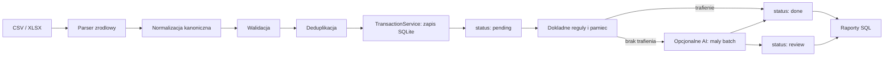

# 12. Plan Uproszczenia Architektury i Zuzycia Zasobow

Data dokumentu: 2026-09-05

## 1. Decyzja wykonawcza

Produkt pozostaje monolitem Next.js + SQLite + Drizzle dla dwoch osob. Nie dodajemy Redis, workera, kolejki zewnetrznej, mikroserwisow ani cache'a aplikacyjnego.

Najwiekszy zysk daja: deterministyczny zapis importu, reguly przed AI, retencja danych pomocniczych, indeksy zgodne z zapytaniami i testy parserow. To sa zmiany o wysokim wplywie na czas odpowiedzi, rozmiar bazy oraz prywatnosc, bez podnoszenia kosztu operacyjnego.

## 1A. Rejestr wdrozenia

| Data | Krok | Stan | Dowod |
| --- | --- | --- | --- |
| 2026-09-05 | Wylaczenie generowanych artefaktow z nowych zmian i zawężenie lint/typecheck | Zrobione | `.gitignore`, `eslint.config.mjs`, `package.json`, `tsconfig.json` |
| 2026-09-05 | Import zbiorczy, retencja tylko blednych wierszy i indeksy transakcji | Zrobione | Migracja `0011`, test izolowanej SQLite w `verify-foundation` |
| 2026-09-05 | Kolejka SQLite `pending/processing/done/review/failed` i exact-first pamiec korekt | Zrobione | Migracja `0012`, test przejecia i odzyskania rekordu |
| 2026-09-05 | Jedna aktualna sugestia AI na transakcje | Zrobione | Migracja `0013`, test upsertu sugestii |
| 2026-09-05 | Limity importu i chunkowy zapis podgladu | Zrobione | Test limitu i zielony lint zmienionych plikow |
| 2026-09-05 | Wspolny `TransactionService` dla wpisu recznego i importu | Zrobione | Test statusow `verified/done` oraz `needs_review/pending` |
| 2026-09-05 | OCR jako jawny wariant obrazu, nie przypadkowy import | Zrobione | Checkbox zgody, test rozpoznania formatu |
| 2026-09-05 | Szyfrowany backup, weryfikacja i migracja trwałej SQLite | Zrobione | Zweryfikowany backup lokalny, migracje `0012` i `0013` zastosowane |
| 2026-09-06 | Odtworzenie backupu na kopii | Zrobione | `verify:foundation`: szyfrowanie, integralność, zmiana źródła, restore i odczyt markera na tymczasowej SQLite |
| 2026-09-05 | Retencja pomocniczych danych importu | Zrobione | Drugi zweryfikowany backup, migracja `0014` zastosowana |
| 2026-09-05 | Konta finansowe dla importu i wpisu ręcznego | Zrobione | `/settings/accounts`, migracja `0015`, test własności i deduplikacji |
| 2026-09-05 | Kanoniczne pola importu walutowego i referencja bankowa | Zrobione | Migracja `0016`, test normalizacji i zapisu waluty, kursu, daty księgowania oraz referencji |
| 2026-09-05 | Lekkie metryki importu bez danych finansowych | Zrobione | `audit_events`: czasy parsera, normalizacji i zapisu oraz liczniki batcha |
| 2026-09-05 | Powtarzalny benchmark importu na izolowanej SQLite | Zrobione | `npm run benchmark:import -- 1000` lub domyślnie 50 000 wierszy |
| 2026-09-05 | Kompaktowanie SQLite po dużych importach | Zrobione | Ręczne `npm run db:compact`; wymaga uprzednio zweryfikowanego backupu |
| 2026-09-05 | Jednorazowa migracja historycznych kluczy deduplikacji do v2 | Zrobione | `db:migrate-dedupe`, test idempotencji; trwała SQLite: 1/1 kluczy v2 po zweryfikowanym backupie |
| 2026-09-06 | E2E krytycznej ścieżki release | Zrobione | `npm run test:e2e`: health, ochrona sesji, import, deduplikacja, review i raporty na tymczasowej SQLite; AI: 0 wywołań, dashboard: 47 ms, review: 10 ms w pomiarze lokalnym |

**Plan wykonawczy jest domknięty:** importy i istniejące klucze deduplikacji używają hashowanego wariantu v2, a krytyczna ścieżka ma powtarzalny test E2E.

**Brama release:** zaliczona 2026-09-06 na Node 24.20.0. `next build` przeszedł kompilację, TypeScript, pobranie danych stron i finalizację; produkcyjny `next start` zwrócił poprawny `/api/health`, a `/dashboard` i `/imports` bez sesji przekierowały `307 → /login`. Projekt wymusza teraz Node 24 LTS przed `npm run build`, więc Node 25 kończy się czytelnym komunikatem zamiast zawieszać Next.js.

## 2. Stan potwierdzony w kodzie

### Co jest trafne i zostaje

- SQLite ma wlaczony WAL i dla docelowej skali jest wlasciwa.
- AI jest wywolywane z `/review`, a nie na goracej sciezce uploadu. Import juz nie czeka na model.
- Pamiec korekt ma pierwszenstwo przed modelem w `categorizeTransactionForUser`.
- Jeden adapter OpenAI-compatible obsluguje model lokalny i zewnetrzny.
- PDF i OCR sa juz awaryjnymi wariantami, a nie wymaganiem do zwyklego importu.
- Raporty sa liczone z transakcji, wiec nie trzeba budowac cache'a jako nowego zrodla prawdy.

### Co obecnie zuzywa zasoby nieproporcjonalnie

1. `createImportPreview` zapisuje dla kazdego wiersza i surowy JSON, i znormalizowany JSON. Dane finansowe sa w praktyce duplikowane przed zatwierdzeniem, a potem pozostaja w bazie po udanym imporcie.
2. `confirmImportForUser` wykonuje dla kazdego wiersza osobne zapytanie o duplikat, insert transakcji i update wiersza importu. Dla duzego pliku jest to wzorzec N+1 operacji SQLite.
3. Klucz duplikatu obejmuje tylko uzytkownika, date, kwote i opis. Nie uwzglednia konta, waluty ani identyfikatora bankowego, mimo ze dokumentacja tego wymaga.
4. Import nie przenosi pelnego rekordu kanonicznego (konto, oryginalna waluta, kurs, data ksiegowania, referencja bankowa). Zmusza to kolejne funkcje do odtwarzania logiki albo tracenia danych.
5. `findCorrectionMemoryCategoryId` wczytuje wszystkie reguly uzytkownika dla kazdej transakcji zamiast korzystac z dokladnego indeksowanego dopasowania.
6. `ai_suggestions` zachowuje kolejne, zastapione sugestie. Dla produktu audit finalnego wyniku jest potrzebny, ale historia kazdej proby modelu nie jest.
7. Brakuje indeksow dla glownych filtracji raportow i kolejki weryfikacji. Obecny indeks daty nie zaczyna sie od `user_id`, przez co gorzej odpowiada realnym zapytaniom.
8. Artefakty Graphify i TypeScript byly sledzone oraz wchodzily w szeroki lint. Zostaly wylaczone dla nowych plikow; obecne sledzone artefakty wymagaja osobnego, swiadomego cleanupu Git.
9. Brakuje automatycznych testow parserow, deduplikacji, izolacji danych i przeplywu review, mimo ze sa wymagane przez NFR-QUAL.

## 3. Docelowy przeplyw



CSV i XLSX sa sciezka podstawowa. PDF z warstwa tekstowa oraz OCR pozostaja jawnie oznaczonymi wariantami awaryjnymi: bez automatycznej kategoryzacji, z limitem rozmiaru/stron i z wymaganym podgladem. Skanu PDF nie nalezy automatycznie przepuszczac przez OCR w tym samym zadaniu HTTP.

## 4. Minimalna warstwa domenowa: `TransactionService`

Nalezy dodac jeden maly modul domenowy, np. `src/domain/transaction-service.ts`. Nie ma to byc framework ani nowy serwis. Ma skupic niezmienniki wspolne dla importu i wpisu recznego:

- normalizacja i walidacja transakcji kanonicznej,
- wyliczenie klucza deduplikacji,
- kontrola przynaleznosci konta i kategorii do uzytkownika,
- wykrycie/oznaczenie kandydata transferu,
- transakcyjny zapis oraz ustawienie statusu kategoryzacji,
- jednorazowe uniewaznienie/oznaczenie danych pomocniczych po imporcie.

Interfejs powinien miec konkretne komendy `createManualTransaction`, `persistImportedTransactions` i pozniej `createFromOcr`, a nie abstrakcyjny silnik przeplywow. Warstwa `db` pozostaje odpowiedzialna za SQL, a Server Actions tylko za autoryzacje, input i przekierowanie.

## 5. Model danych po uproszczeniu

### Transakcje

Rozdzielic dwa znaczenia, ktore obecnie miesza `verification_status`:

| Pole | Dozwolone wartosci | Znaczenie |
| --- | --- | --- |
| `categorization_status` | `pending`, `processing`, `done`, `review`, `failed` | stan technicznego procesu kategoryzacji |
| `verification_status` | `verified`, `auto_categorized`, `needs_review` | zaufanie do finalnej kategorii |

`processing` wymaga `categorization_started_at`. Przy pobieraniu batcha należy atomowo przejac tylko rekordy `pending`; rekordy starsze niz ustalony TTL mozna bezpiecznie zwrocic do `pending`. To chroni przed przerwanym zadaniem bez Redisa i workera.

Rekord kanoniczny przenosi `financial_account_id`, `posted_date`, `currency`, `amount_minor`, `amount_pln_minor`, `fx_rate` i `bank_reference`. Kwota raportowa pozostaje zawsze dodatnia; typ rozroznia przychod i wydatek. Dla waluty innej niz PLN importer wymaga jawnie zmapowanego kursu PLN; nie zgaduje przeliczenia.

Klucz deduplikacji powinien byc hashem wersjonowanego zestawu:

`v2 | userId | financialAccountId | bankReference? | transactionDate | postedDate? | amountMinor | currency | merchantKey/descriptionKey`

Nie zmieniac historycznych kluczy w miejscu. Wprowadzic nowy wariant i zdefiniowac jednorazowa, testowana migracje dla starych rekordow.

### Batch importu i dane pomocnicze

- Przed zatwierdzeniem przechowywac tylko to, co potrzebne do podgladu i ponownego POST: rekord kanoniczny oraz blad walidacji.
- Po udanym zatwierdzeniu usuwac `imported_rows` dla wierszy poprawnych i duplikatow. `import_batches` zachowuje licznik, hash, wersje parsera, daty i wynik importu.
- Dla bledow zostawic minimalny, zredagowany kontekst albo licznik i komunikat; nie archiwizowac calego pliku ani pelnych surowych danych domyslnie.
- Uzyc insertow w chunkach i unikalnego indeksu jako ostatecznej ochrony. Najpierw wyliczyc kandydaty duplikatow jednym zapytaniem, a przy zapisie obsluzyc konflikt bez przerywania calego batcha.

### Reguly i AI

- Trzymac `UserCorrectionMemory`; jest to podstawowy mechanizm ograniczajacy koszt modeli.
- Normalizowac merchant podczas importu i szukac najpierw dokladnej reguly `(user_id, pattern_type, pattern_value)`. Dopiero potem ograniczone dopasowanie opisu.
- Zamiast historii wszystkich prob modelu zachowac najwyzej jedna aktualna sugestie na transakcje (upsert albo usuniecie poprzedniej) i finalny stan na transakcji. Metryki zagregowane mozna liczyc bez promptow i odpowiedzi.
- Kolejnosc decyzji: dokladna regula merchanta -> pamiec korekty -> deterministyczna heurystyka -> AI -> review. Regula oznacza `done`; AI tylko proponuje lub ustawia `review`.
- Batch ma staly limit, np. 10 pozycji dla zewnetrznego API i 5 dla lokalnego modelu. Jest uruchamiany przez użytkownika na `/review`; importer nigdy go nie wywoluje.

## 6. Indeksy SQLite

Wprowadzic je po pomiarze `EXPLAIN QUERY PLAN` na zanonimizowanej bazie z 50 tys. transakcji. Docelowe kandydaty:

```sql
CREATE INDEX transactions_user_date_idx
  ON transactions(user_id, transaction_date);
CREATE INDEX transactions_user_type_date_idx
  ON transactions(user_id, type, transaction_date);
CREATE INDEX transactions_user_category_date_idx
  ON transactions(user_id, category_id, transaction_date);
CREATE INDEX transactions_account_date_idx
  ON transactions(financial_account_id, transaction_date);
CREATE INDEX transactions_user_review_date_idx
  ON transactions(user_id, verification_status, transaction_date);
CREATE INDEX ai_suggestions_user_transaction_status_idx
  ON ai_suggestions(user_id, transaction_id, status);
```

Nie dodawac indeksu tylko dlatego, ze pole istnieje. Kazdy indeks zwieksza koszt importu i rozmiar pliku SQLite. Istniejacy unikalny indeks deduplikacji zachowac, po migracji klucza v2 sprawdzic jego selektywnosc.

## 7. Kolejnosc realizacji

### Faza 0 — bazowy pomiar i porzadek repozytorium

1. Zmierz czas importu 1 000 i 50 000 zanonimizowanych rekordow, rozmiar pliku SQLite przed/po, liczbe wywolan AI oraz czas dashboardu i `/review`.
2. Uruchamiaj lint oraz typecheck sekwencyjnie. Konfiguracja juz ogranicza lint do `src` i `next.config.ts`, a TypeScript do kodu aplikacji.
3. Po zatwierdzeniu zmian w katalogu `graphify-out` wykonaj osobny commit sprzatajacy: usun artefakty z indeksu Git (bez kasowania lokalnego katalogu) i pozostaw jedynie opcjonalny, odtwarzalny raport poza repozytorium. Nie laczyc tego z migracja danych.
4. Dodaj małe testy jednostkowe dla normalizacji dat/kwot, dedupe key i parserow bankowych z fixture'ami zanonimizowanymi.

Kryterium: powtarzalny raport bazowy oraz szybki lint/typecheck bez skanowania wygenerowanych danych.

Po dużym imporcie usunięte wiersze podglądu pozostawiają wolne strony w pliku SQLite. Nie uruchamiać `VACUUM` na gorącej ścieżce importu; po zweryfikowanym backupie można wykonać ręcznie `npm run db:compact` w oknie utrzymaniowym.

### Faza 1 — import bez AI i bez duplikacji danych

1. Zdefiniuj typ `CanonicalTransaction` i przenies normalizacje z Server Action do domeny.
2. Dodaj `TransactionService` i przeprowadz przez niego wpis reczny oraz import; zachowaj istniejące zachowanie UI.
3. Dodaj konto finansowe do importu, wersjonowany dedupe key i transakcyjny zapis chunkowy.
4. Usuń dane per-wiersz po sukcesie importu, zachowując metryki batcha; ogranicz preview do ustalonego limitu widoku.
5. Dodaj indeksy potwierdzone przez `EXPLAIN QUERY PLAN`.

Kryterium: import 1 000 rekordow konczy sie w mniej niz 30 sekund bez AI, ponowny import jest idempotentny, a udany import nie podwaja dlugotrwale danych zrodlowych.

### Faza 2 — kontrolowana kategoryzacja

1. Dodaj jawny stan kategoryzacji z odzyskiwaniem zablokowanego `processing`.
2. Zmien wyszukiwanie pamieci na indeksowane dopasowanie exact-first i rejestruj wykorzystanie reguly.
3. Ogranicz `ai_suggestions` do jednej aktualnej sugestii; przenies metryki jakosci do agregatow.
4. Zmien batch `/review` na przejecie ograniczonej liczby `pending`, sekwencyjne przetwarzanie i czytelny wynik dla czesciowych bledow.
5. Dodaj testy kontraktu odpowiedzi AI oraz przypadki: nieistniejaca kategoria, awaria providera, niska pewnosc i pamiec bez AI.

Kryterium: poprawnie zapamietany merchant nie wywoluje AI, a przerwany batch nie pozostawia stale zablokowanych transakcji.

### Faza 3 — ograniczenie ciezkich formatow i obserwowalnosc

1. Ustaw limity uploadu: format, rozmiar, liczba wierszy oraz czas dla CSV/XLSX; bledy pokazuj uzytkownikowi bez logowania danych.
2. PDF traktuj jako odrebny, tekstowy tryb importu. OCR uruchamiaj tylko po swiadomym wyborze, z limitem jednego obrazu i bez automatycznej proby dla PDF.
3. Zweryfikuj, czy OCR jest realnie używany. Jesli nie, przenies `tesseract.js` poza domyslny runtime lub usun z podstawowego obrazu Dockerowego; zyskasz mniej RAM, mniejszy obraz i mniej pobieranych modeli.
4. Dodaj lekkie pomiary: czas parse/normalizacji/zapisu, liczba nowych/duplikatow/bledow, liczba trafien reguly i wywolan AI. Nie zapisuj tresci transakcji, promptow ani wierszy.

Kryterium: zwykly import CSV/XLSX nie laduje PDF/OCR ani AI i kazdy regres mozna wykryc po licznikach.

### Faza 4 — releasowosc

1. E2E krytycznej ścieżki jest w `npm run test:e2e`: tymczasowa sesja -> import CSV w warstwie domenowej -> dedupe -> review -> chronione raporty/strony.
2. Przed releasem uruchamiaj sekwencyjnie lint, typecheck, testy, build i restore backupu na kopii; `verify:foundation` automatycznie testuje ostatni krok na tymczasowej SQLite.
3. Zaktualizuj `docs/04_ARCHITECTURE.md`, `docs/05_DATA_MODEL.md`, `docs/06_IMPORTS.md`, `docs/07_AI_CATEGORIZATION.md` oraz ADR-y dopiero razem z wdrazaną migracja, aby nie tworzyc dokumentacji wyprzedzajacej kod.

## 8. Ocena wczesniejszych propozycji

| Propozycja | Decyzja | Doprecyzowanie |
| --- | --- | --- |
| Oddzielic import od AI | Przyjac | Zapis importu ustawia `pending`; AI jest tylko zadaniem review. |
| Rules -> memory -> heurystyka -> AI | Przyjac | Najpierw exact merchant; wzorce opisowe musza byc ograniczone i indeksowane. |
| Bez workera, Redisa i kolejki | Przyjac | Status w SQLite z atomowym przejeciem i TTL wystarcza. |
| PDF/OCR jako awaria | Przyjac | Dodac limity i nie wykonywac OCR automatycznie dla PDF. |
| Indeksy zamiast cache'a | Przyjac warunkowo | Tylko po `EXPLAIN` i benchmarku; indeksy maja koszt zapisu. |
| Jedna sugestia AI plus wynik finalny | Przyjac | Zachowac aktualna sugestie, nie historie kazdej proby. |
| Nie rozwijac inwestycji w brokera | Przyjac | Pozostawic aktywa, operacje, wycene i strategie; bez importu brokerow/rebalancingu. |
| Centralny `TransactionService` | Przyjac | Maly modul z konkretnymi komendami, nie nowa warstwa enterprise. |

## 9. Swiadomie poza zakresem

- migracja z SQLite do PostgreSQL,
- Redis, worker, broker wiadomosci i mikroserwisy,
- cache raportow jako osobna baza prawdy,
- automatyczna synchronizacja bankow,
- importer brokerski, rozliczenia podatkowe i zaawansowany rebalancing,
- archiwum zrodlowych plikow importu,
- automatyczne rekomendacje inwestycyjne.

Do tych tematow mozna wrocic tylko po pomiarze przekraczajacym zalozenia: wiecej niz dwoch aktywnych osob, istotna wspolbieznosc zapisow albo wolne zapytania mimo poprawnych indeksow.
